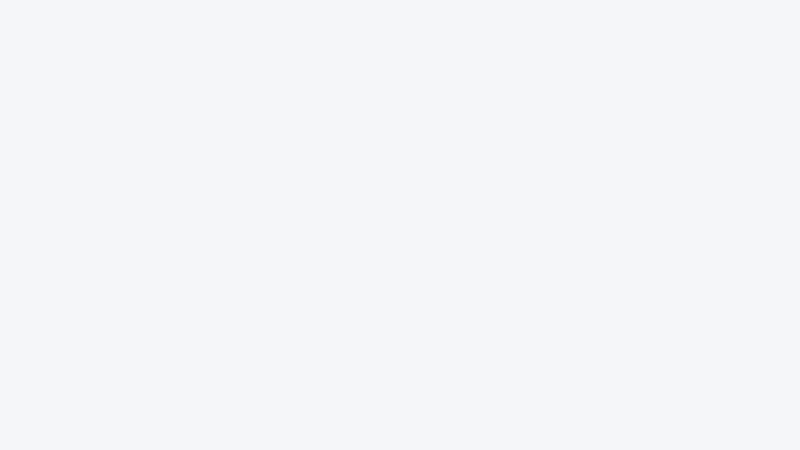

# 🐟 Sentifish

**Web search provider benchmarking platform** — run standardized IR evaluations across Brave, Serper, Tavily, and TinyFish, then compare results side-by-side.

## Why

Search APIs all claim to be the best. Sentifish lets you prove it with data: run the same queries across multiple providers, score them with real IR metrics, and see who actually delivers.

## Demo

<p align="center">
  
</p>
<p align="center"><em>Providers competing head-to-head on the same queries</em></p>

<p align="center">
  
</p>
<p align="center"><em>Precision, Recall, NDCG, MRR scored per provider</em></p>

<p align="center">
  
</p>
<p align="center"><em>NDCG@10 quality tracking across runs</em></p>

<p align="center">
  
</p>
<p align="center"><em>Full dashboard with stats, comparisons, and run history</em></p>

## Features

- **4 search providers**: Brave, Serper, Tavily, TinyFish (SSE streaming with DuckDuckGo)
- **IR scoring**: Precision@K, Recall@K, NDCG@K, MRR, Latency
- **Async evaluation runs**: POST triggers run, poll for results as providers finish
- **Dashboard UI**: provider head-to-head comparison, NDCG trend charts, run history
- **Typed API client**: full TypeScript SDK with React Query integration
- **Persistent results**: in-memory store + disk persistence to `./results/`
- **Dataset management**: create, list, and manage evaluation datasets
- **Railway-ready**: Dockerfile + railway.toml included

## Architecture

```
sentifish/          → Backend (Python/FastAPI)
sentifish-ui/       → Frontend (React/Vite/TypeScript)
```

### Backend

Python FastAPI server with async evaluation engine.

- Providers run concurrently (TinyFish: 2 concurrent, others: 5)
- Scores stream in as providers complete via `as_completed`
- Results persisted to `./results/` on disk

### Frontend

React SPA with a mobile-first dashboard.

- **React + Vite + TypeScript** with SWC
- **shadcn/ui** component library (Radix primitives)
- **Framer Motion** animations
- **Tailwind CSS** with custom design tokens (DM Sans + JetBrains Mono)
- **React Query** for server state
- **React Router** for navigation

Dashboard components:
| Component | What it shows |
|---|---|
| `StatCards` | Total queries evaluated, best NDCG@10, fastest provider, total runs |
| `ProviderComparison` | Animated bar charts comparing P@K, R@K, NDCG, MRR across all providers |
| `TrendChart` | NDCG@10 sparklines over last 12 runs per provider |
| `RecentRuns` | Timeline of evaluation runs with status, provider badges, best scores |
| `InsightCard` | Auto-generated evaluation insights |

## Quick Start

### Backend

```bash
cd server
uv sync --all-groups
cp ../env.sample .env   # fill in API keys
./run
```

Server starts at `http://localhost:4010`.

### Frontend

```bash
cd ../sentifish-ui
npm install
npm run dev
```

UI starts at `http://localhost:5173`. Set `VITE_SENTIFISH_API_URL` to point at the backend.

## API

| Endpoint | Method | Description |
|---|---|---|
| `/health` | GET | Health check |
| `/api/providers` | GET | List configured providers |
| `/api/datasets` | GET/POST | List or create datasets |
| `/api/datasets/{name}` | GET/DELETE | Get or delete a dataset |
| `/api/runs` | GET/POST | List runs or trigger a new eval |
| `/api/runs/{id}` | GET | Full run results |
| `/api/runs/{id}/summary` | GET | Aggregated scores per provider |

### Trigger an eval

```bash
curl -X POST http://localhost:4010/api/runs \
  -H "Content-Type: application/json" \
  -d '{"dataset": "sample", "providers": ["brave", "serper", "tavily", "tinyfish"], "top_k": 10}'
```

### Poll for results

```bash
curl http://localhost:4010/api/runs/{run_id}
```

Scores stream in as providers complete — no need to wait for the slowest one.

## Sample Dataset

Ships with 5 evaluation queries:

| Query | Tags |
|---|---|
| Python FastAPI tutorial | programming, python |
| how to make sourdough bread | cooking, baking |
| transformer architecture explained | machine learning, AI |
| best practices REST API design | programming, architecture |
| climate change effects on coral reefs | science, environment |

## Metrics

| Metric | What it measures |
|---|---|
| **Precision@K** | Fraction of top-K results that are relevant |
| **Recall@K** | Fraction of known relevant docs found in top-K |
| **NDCG@K** | Ranking quality (rewards relevant results appearing higher) |
| **MRR** | How quickly the first relevant result appears |
| **Latency** | Wall-clock response time per provider |

## Tests

```bash
cd server
uv run pytest --cov=app tests/
```

## Deploy

Deploys via Docker on Railway. Push to `main` triggers auto-deploy.

```bash
docker build -t sentifish .
docker run -p 4010:4010 --env-file .env sentifish
```

## Tech Stack

| Layer | Stack |
|---|---|
| Backend | Python, FastAPI, asyncio, uv |
| Frontend | React 18, Vite, TypeScript, Tailwind, shadcn/ui, Framer Motion |
| Scoring | Custom IR metrics engine (Precision, Recall, NDCG, MRR) |
| Search | Brave API, Serper API, Tavily API, TinyFish API (SSE) |
| Storage | In-memory + disk persistence |
| Deploy | Docker, Railway |

## Research

The `docs/research/` directory contains 47 research files on agentic frameworks, evaluation methods, and observability — the background research that shaped Sentifish's design.

## License

MIT
